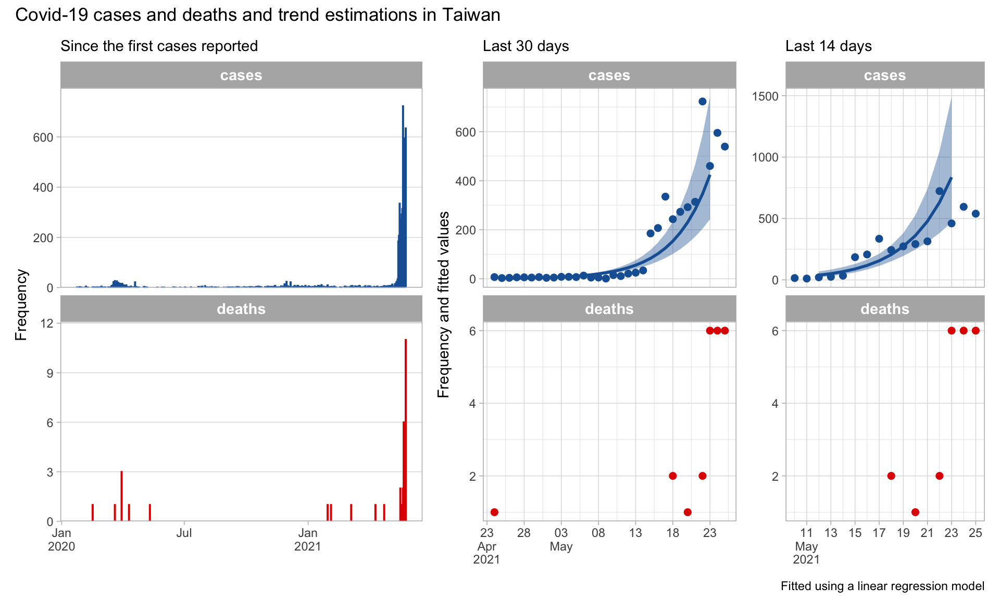

<!-- README.md is generated from README.Rmd. Please edit that file -->

# covidutils

<!-- badges: start -->
<!-- badges: end -->

Centralised utility functions for covid related projects at Epicentre.

## Installation

Install covidutils from github with:

``` r
remotes::install_github("epicentre-msf/covidutils")
```

## Development

To include a function in the package, add it to a script in the `R/`
directory.

### Best practices

-   Large functions should have their own `.R` script inside the `R/`
    directory with an information name, `get_ecdc.R` for example
-   Smaller utility functions can be grouped into a single script such
    as `utils.R`
-   If you are using functions used from external packages inside your
    own function, they must be fully qualified i.e. `dplyr::filter()`
-   All external packages used must be added to the imports section of
    the `DESCRIPTION` file. This can be done via
    `usethis::use_package("name_of_package")`
-   All variables used within a function should be passed as arguments
-   Document your functions using [roxygen
    syntax](https://roxygen2.r-lib.org/)
-   When your changes are ready and documented:
    -   run `devtools::document()` to build the appropriate
        documentation files
    -   run `devtools::check()` to check the package for any errors or
        warnings
    -   run `devtools::install()` to install or re-install the package
        on your system
    -   consider adding a usage of example of any new functions in this
        `README.Rmd` below then knit the document to produce the `.md`
        format required for github
    -   push the changes to github

If using RStudio, you can document, check and install the package with
option in the ‘Build’ pane.

When developing new functions you can run `devtools::load_all()` at
anytime load the current state of all function in the `R/` directory.

Further R package development resources:

-   [Hadley Wickham’s R Packages book](https://r-pkgs.org/) (free
    online)
-   [Karl Broman’s R package primer](https://kbroman.org/pkg_primer/)
-   [Hilary Parker’s R package from scratch
    tutorial](https://hilaryparker.com/2014/04/29/writing-an-r-package-from-scratch/)

## Function examples

``` r
library(tidyverse)
library(covidutils)
```

### Import JHU CSSE data

``` r
df_covid <- get_owid_jhcsse()
glimpse(df_covid)
#> Rows: 84,398
#> Columns: 7
#> $ date      <date> 2020-02-24, 2020-02-25, 2020-02-26, 2020-02-27, 2020-02-28,…
#> $ continent <chr> "Asia", "Asia", "Asia", "Asia", "Asia", "Asia", "Asia", "Asi…
#> $ region    <chr> "Southern Asia", "Southern Asia", "Southern Asia", "Southern…
#> $ country   <chr> "Afghanistan", "Afghanistan", "Afghanistan", "Afghanistan", …
#> $ iso_a3    <chr> "AFG", "AFG", "AFG", "AFG", "AFG", "AFG", "AFG", "AFG", "AFG…
#> $ cases     <dbl> 1, 0, 0, 0, 0, 0, 0, 0, 1, 2, 0, 0, 0, 1, 2, 1, 3, 1, 1, 2, …
#> $ deaths    <dbl> NA, NA, NA, NA, NA, NA, NA, NA, NA, NA, NA, NA, NA, NA, NA, …
```

### Compute 14 and 30 day case and death trends

``` r
df_trends <- get_country_summaries(df_covid)
glimpse(df_trends)
#> Rows: 190
#> Columns: 53
#> $ continent                    <chr> "Asia", "Europe", "Africa", "Europe", "Af…
#> $ region                       <chr> "Southern Asia", "Southern Europe", "Nort…
#> $ country                      <chr> "Afghanistan", "Albania", "Algeria", "And…
#> $ iso_a3                       <chr> "AFG", "ALB", "DZA", "AND", "AGO", "ATG",…
#> $ population                   <dbl> 38928341, 2877800, 43851043, 77265, 32866…
#> $ cases                        <dbl> 67743, 132244, 127646, 13671, 33338, 1258…
#> $ deaths                       <dbl> 2855, 2447, 3440, 127, 742, 42, 75588, 44…
#> $ cases_inc                    <dbl> 174.01975, 4595.31587, 291.09000, 17693.6…
#> $ deaths_inc                   <dbl> 7.3339884, 85.0302314, 7.8447393, 164.369…
#> $ date_start_14d               <date> 2021-05-11, 2021-05-11, 2021-05-11, 2021…
#> $ date_end_14d                 <date> 2021-05-24, 2021-05-24, 2021-05-24, 2021…
#> $ cases_14d                    <dbl> 4212, 462, 2819, 140, 3748, 21, 397014, 2…
#> $ trend_cases_14d              <chr> "Likely increasing", "Decreasing", "Incre…
#> $ trend_cases_coeff_14d        <dbl> 0.064730659, -0.063993259, 0.035337112, -…
#> $ trend_cases_coeff_lwr95_14d  <dbl> -0.0300305835, -0.0854030956, 0.004928549…
#> $ trend_cases_coeff_upr95_14d  <dbl> 0.159491902, -0.042583422, 0.065745676, 0…
#> $ trend_cases_preds_14d        <list> [<tbl_df[12 x 6]>], [<tbl_df[12 x 6]>], …
#> $ dt_cases_est_14d             <dbl> 10.708174, NA, 19.615275, NA, NA, NA, 23.…
#> $ dt_cases_lwr_14d             <dbl> 4.345971, NA, 10.542856, NA, NA, NA, 11.4…
#> $ dt_cases_upr_14d             <dbl> -23.08138, NA, 140.63919, NA, NA, NA, -90…
#> $ deaths_14d                   <dbl> 114, 29, 91, 0, 95, 10, 6659, 145, 0, 155…
#> $ cases_inc_14d                <dbl> 10.8375675, 16.8243617, 6.4469333, 219.66…
#> $ deaths_inc_14d               <dbl> 0.293355407, 1.056241202, 0.208126122, 0.…
#> $ trend_deaths_14d             <chr> "Increasing", NA, "Stable", NA, "Likely i…
#> $ trend_deaths_coeff_14d       <dbl> 0.0462455276, NA, -0.0007424017, NA, 0.06…
#> $ trend_deaths_coeff_lwr95_14d <dbl> 0.0123976954, NA, -0.0236794925, NA, -0.0…
#> $ trend_deaths_coeff_upr95_14d <dbl> 0.080093360, NA, 0.022194689, NA, 0.14063…
#> $ trend_deaths_preds_14d       <list> [<tbl_df[12 x 6]>], <NULL>, [<tbl_df[12 …
#> $ dt_deaths_est_14d            <dbl> 14.988415, NA, NA, NA, 9.903671, NA, NA, …
#> $ dt_deaths_lwr_14d            <dbl> 8.654240, NA, NA, NA, 4.928621, NA, NA, N…
#> $ dt_deaths_upr_14d            <dbl> 55.90936, NA, NA, NA, -1051.30328, NA, NA…
#> $ date_start_30d               <date> 2021-04-25, 2021-04-25, 2021-04-25, 2021…
#> $ date_end_30d                 <date> 2021-05-24, 2021-05-24, 2021-05-24, 2021…
#> $ cases_30d                    <dbl> 7545, 1806, 6371, 545, 7131, 32, 716263, …
#> $ trend_cases_30d              <chr> "Increasing", "Decreasing", "Likely decre…
#> $ trend_cases_coeff_30d        <dbl> 0.020014257, -0.060730704, -0.005639469, …
#> $ trend_cases_coeff_lwr95_30d  <dbl> 0.0027712747, -0.0693098542, -0.013201830…
#> $ trend_cases_coeff_upr95_30d  <dbl> 0.037257239, -0.052151554, 0.001922893, -…
#> $ trend_cases_preds_30d        <list> [<tbl_df[28 x 6]>], [<tbl_df[28 x 6]>], …
#> $ dt_cases_est_30d             <dbl> 34.63267, NA, NA, NA, 46.68539, NA, 36.74…
#> $ dt_cases_lwr_30d             <dbl> 18.60436, NA, NA, NA, 29.36814, NA, 24.53…
#> $ dt_cases_upr_30d             <dbl> 250.11854, NA, NA, NA, 113.77279, NA, 73.…
#> $ deaths_30d                   <dbl> 240, 73, 228, 3, 154, 11, 13006, 393, 0, …
#> $ cases_inc_30d                <dbl> 19.411784, 65.735786, 14.569023, 849.7170…
#> $ deaths_inc_30d               <dbl> 0.61758833, 2.65877145, 0.52145722, 4.717…
#> $ trend_deaths_30d             <chr> "Stable", "Decreasing", "Decreasing", NA,…
#> $ trend_deaths_coeff_30d       <dbl> 0.0044184199, -0.0243032375, -0.019043692…
#> $ trend_deaths_coeff_lwr95_30d <dbl> -0.0057519741, -0.0358803712, -0.02415841…
#> $ trend_deaths_coeff_upr95_30d <dbl> 0.014588814, -0.012726104, -0.013928973, …
#> $ trend_deaths_preds_30d       <list> [<tbl_df[28 x 6]>], [<tbl_df[28 x 6]>], …
#> $ dt_deaths_est_30d            <dbl> NA, NA, NA, NA, 18.40781, NA, 74.13533, N…
#> $ dt_deaths_lwr_30d            <dbl> NA, NA, NA, NA, 12.74496, NA, 37.34709, N…
#> $ dt_deaths_upr_30d            <dbl> NA, NA, NA, NA, 33.12665, NA, 4954.40056,…
```

``` r
# country with fastest growing case numbers in last 14 days
(iso <- df_trends %>% 
  filter(trend_cases_coeff_14d == max(trend_cases_coeff_14d, na.rm = TRUE)) %>% 
  pull(iso_a3))
#> [1] "TWN"
df_country <- df_covid %>% filter(iso_a3 == iso)
df_trends_country <- df_trends %>% filter(iso_a3 == iso)
```

``` r
country_plot(df_country, df_trends_country, add_title = TRUE)
```



``` r
country_table(df_trends_country)
```

<!--html_preserve-->
<style>html {
  font-family: -apple-system, BlinkMacSystemFont, 'Segoe UI', Roboto, Oxygen, Ubuntu, Cantarell, 'Helvetica Neue', 'Fira Sans', 'Droid Sans', Arial, sans-serif;
}

#izifkjoovv .gt_table {
  display: table;
  border-collapse: collapse;
  margin-left: auto;
  margin-right: auto;
  color: #333333;
  font-size: 16px;
  font-weight: normal;
  font-style: normal;
  background-color: #FFFFFF;
  width: auto;
  border-top-style: solid;
  border-top-width: 2px;
  border-top-color: #A8A8A8;
  border-right-style: none;
  border-right-width: 2px;
  border-right-color: #D3D3D3;
  border-bottom-style: solid;
  border-bottom-width: 2px;
  border-bottom-color: #A8A8A8;
  border-left-style: none;
  border-left-width: 2px;
  border-left-color: #D3D3D3;
}

#izifkjoovv .gt_heading {
  background-color: #FFFFFF;
  text-align: center;
  border-bottom-color: #FFFFFF;
  border-left-style: none;
  border-left-width: 1px;
  border-left-color: #D3D3D3;
  border-right-style: none;
  border-right-width: 1px;
  border-right-color: #D3D3D3;
}

#izifkjoovv .gt_title {
  color: #333333;
  font-size: 125%;
  font-weight: initial;
  padding-top: 4px;
  padding-bottom: 4px;
  border-bottom-color: #FFFFFF;
  border-bottom-width: 0;
}

#izifkjoovv .gt_subtitle {
  color: #333333;
  font-size: 85%;
  font-weight: initial;
  padding-top: 0;
  padding-bottom: 4px;
  border-top-color: #FFFFFF;
  border-top-width: 0;
}

#izifkjoovv .gt_bottom_border {
  border-bottom-style: solid;
  border-bottom-width: 2px;
  border-bottom-color: #D3D3D3;
}

#izifkjoovv .gt_col_headings {
  border-top-style: solid;
  border-top-width: 2px;
  border-top-color: #D3D3D3;
  border-bottom-style: solid;
  border-bottom-width: 2px;
  border-bottom-color: #D3D3D3;
  border-left-style: none;
  border-left-width: 1px;
  border-left-color: #D3D3D3;
  border-right-style: none;
  border-right-width: 1px;
  border-right-color: #D3D3D3;
}

#izifkjoovv .gt_col_heading {
  color: #333333;
  background-color: #FFFFFF;
  font-size: 100%;
  font-weight: bold;
  text-transform: inherit;
  border-left-style: none;
  border-left-width: 1px;
  border-left-color: #D3D3D3;
  border-right-style: none;
  border-right-width: 1px;
  border-right-color: #D3D3D3;
  vertical-align: bottom;
  padding-top: 5px;
  padding-bottom: 6px;
  padding-left: 5px;
  padding-right: 5px;
  overflow-x: hidden;
}

#izifkjoovv .gt_column_spanner_outer {
  color: #333333;
  background-color: #FFFFFF;
  font-size: 100%;
  font-weight: bold;
  text-transform: inherit;
  padding-top: 0;
  padding-bottom: 0;
  padding-left: 4px;
  padding-right: 4px;
}

#izifkjoovv .gt_column_spanner_outer:first-child {
  padding-left: 0;
}

#izifkjoovv .gt_column_spanner_outer:last-child {
  padding-right: 0;
}

#izifkjoovv .gt_column_spanner {
  border-bottom-style: solid;
  border-bottom-width: 2px;
  border-bottom-color: #D3D3D3;
  vertical-align: bottom;
  padding-top: 5px;
  padding-bottom: 6px;
  overflow-x: hidden;
  display: inline-block;
  width: 100%;
}

#izifkjoovv .gt_group_heading {
  padding: 8px;
  color: #333333;
  background-color: #FFFFFF;
  font-size: 100%;
  font-weight: initial;
  text-transform: inherit;
  border-top-style: solid;
  border-top-width: 2px;
  border-top-color: #D3D3D3;
  border-bottom-style: solid;
  border-bottom-width: 2px;
  border-bottom-color: #D3D3D3;
  border-left-style: none;
  border-left-width: 1px;
  border-left-color: #D3D3D3;
  border-right-style: none;
  border-right-width: 1px;
  border-right-color: #D3D3D3;
  vertical-align: middle;
}

#izifkjoovv .gt_empty_group_heading {
  padding: 0.5px;
  color: #333333;
  background-color: #FFFFFF;
  font-size: 100%;
  font-weight: initial;
  border-top-style: solid;
  border-top-width: 2px;
  border-top-color: #D3D3D3;
  border-bottom-style: solid;
  border-bottom-width: 2px;
  border-bottom-color: #D3D3D3;
  vertical-align: middle;
}

#izifkjoovv .gt_from_md > :first-child {
  margin-top: 0;
}

#izifkjoovv .gt_from_md > :last-child {
  margin-bottom: 0;
}

#izifkjoovv .gt_row {
  padding-top: 1px;
  padding-bottom: 1px;
  padding-left: 5px;
  padding-right: 5px;
  margin: 10px;
  border-top-style: solid;
  border-top-width: 1px;
  border-top-color: #D3D3D3;
  border-left-style: none;
  border-left-width: 1px;
  border-left-color: #D3D3D3;
  border-right-style: none;
  border-right-width: 1px;
  border-right-color: #D3D3D3;
  vertical-align: middle;
  overflow-x: hidden;
}

#izifkjoovv .gt_stub {
  color: #333333;
  background-color: #FFFFFF;
  font-size: 100%;
  font-weight: initial;
  text-transform: inherit;
  border-right-style: solid;
  border-right-width: 2px;
  border-right-color: #D3D3D3;
  padding-left: 12px;
}

#izifkjoovv .gt_summary_row {
  color: #333333;
  background-color: #FFFFFF;
  text-transform: inherit;
  padding-top: 8px;
  padding-bottom: 8px;
  padding-left: 5px;
  padding-right: 5px;
}

#izifkjoovv .gt_first_summary_row {
  padding-top: 8px;
  padding-bottom: 8px;
  padding-left: 5px;
  padding-right: 5px;
  border-top-style: solid;
  border-top-width: 2px;
  border-top-color: #D3D3D3;
}

#izifkjoovv .gt_grand_summary_row {
  color: #333333;
  background-color: #FFFFFF;
  text-transform: inherit;
  padding-top: 8px;
  padding-bottom: 8px;
  padding-left: 5px;
  padding-right: 5px;
}

#izifkjoovv .gt_first_grand_summary_row {
  padding-top: 8px;
  padding-bottom: 8px;
  padding-left: 5px;
  padding-right: 5px;
  border-top-style: double;
  border-top-width: 6px;
  border-top-color: #D3D3D3;
}

#izifkjoovv .gt_striped {
  background-color: rgba(128, 128, 128, 0.05);
}

#izifkjoovv .gt_table_body {
  border-top-style: solid;
  border-top-width: 2px;
  border-top-color: #D3D3D3;
  border-bottom-style: solid;
  border-bottom-width: 2px;
  border-bottom-color: #D3D3D3;
}

#izifkjoovv .gt_footnotes {
  color: #333333;
  background-color: #FFFFFF;
  border-bottom-style: none;
  border-bottom-width: 2px;
  border-bottom-color: #D3D3D3;
  border-left-style: none;
  border-left-width: 2px;
  border-left-color: #D3D3D3;
  border-right-style: none;
  border-right-width: 2px;
  border-right-color: #D3D3D3;
}

#izifkjoovv .gt_footnote {
  margin: 0px;
  font-size: 90%;
  padding: 4px;
}

#izifkjoovv .gt_sourcenotes {
  color: #333333;
  background-color: #FFFFFF;
  border-bottom-style: none;
  border-bottom-width: 2px;
  border-bottom-color: #D3D3D3;
  border-left-style: none;
  border-left-width: 2px;
  border-left-color: #D3D3D3;
  border-right-style: none;
  border-right-width: 2px;
  border-right-color: #D3D3D3;
}

#izifkjoovv .gt_sourcenote {
  font-size: 90%;
  padding: 4px;
}

#izifkjoovv .gt_left {
  text-align: left;
}

#izifkjoovv .gt_center {
  text-align: center;
}

#izifkjoovv .gt_right {
  text-align: right;
  font-variant-numeric: tabular-nums;
}

#izifkjoovv .gt_font_normal {
  font-weight: normal;
}

#izifkjoovv .gt_font_bold {
  font-weight: bold;
}

#izifkjoovv .gt_font_italic {
  font-style: italic;
}

#izifkjoovv .gt_super {
  font-size: 65%;
}

#izifkjoovv .gt_footnote_marks {
  font-style: italic;
  font-size: 65%;
}
</style>

<div id="izifkjoovv"
style="overflow-x:auto;overflow-y:auto;width:auto;height:auto;">

<table class="gt_table">
<thead class="gt_col_headings">
<tr>
<th class="gt_col_heading gt_center gt_columns_bottom_border" rowspan="2" colspan="1">
Period
</th>
<th class="gt_center gt_columns_top_border gt_column_spanner_outer" rowspan="1" colspan="2">
<span class="gt_column_spanner">Count</span>
</th>
<th class="gt_col_heading gt_center gt_columns_bottom_border" rowspan="2" colspan="1">
naive CFR
</th>
<th class="gt_center gt_columns_top_border gt_column_spanner_outer" rowspan="1" colspan="2">
<span class="gt_column_spanner">Cumulative incidence<br> per 100,000
pop</span>
</th>
<th class="gt_center gt_columns_top_border gt_column_spanner_outer" rowspan="1" colspan="2">
<span class="gt_column_spanner">Doubling time<br>in cases</span>
</th>
<th class="gt_center gt_columns_top_border gt_column_spanner_outer" rowspan="1" colspan="2">
<span class="gt_column_spanner">Doubling time<br>in deaths</span>
</th>
</tr>
<tr>
<th class="gt_col_heading gt_columns_bottom_border gt_center" rowspan="1" colspan="1">
Cases
</th>
<th class="gt_col_heading gt_columns_bottom_border gt_center" rowspan="1" colspan="1">
Deaths
</th>
<th class="gt_col_heading gt_columns_bottom_border gt_center" rowspan="1" colspan="1">
Cases
</th>
<th class="gt_col_heading gt_columns_bottom_border gt_center" rowspan="1" colspan="1">
Deaths
</th>
<th class="gt_col_heading gt_columns_bottom_border gt_center" rowspan="1" colspan="1">
Rate
</th>
<th class="gt_col_heading gt_columns_bottom_border gt_center" rowspan="1" colspan="1">
\[95% CI\]
</th>
<th class="gt_col_heading gt_columns_bottom_border gt_center" rowspan="1" colspan="1">
Rate
</th>
<th class="gt_col_heading gt_columns_bottom_border gt_center" rowspan="1" colspan="1">
\[95% CI\]
</th>
</tr>
</thead>
<tbody class="gt_table_body">
<tr>
<td class="gt_row gt_left">
Total
</td>
<td class="gt_row gt_right">
6,091
</td>
<td class="gt_row gt_right">
46
</td>
<td class="gt_row gt_right">
0.8
</td>
<td class="gt_row gt_right">
26
</td>
<td class="gt_row gt_right">
0
</td>
<td class="gt_row gt_right">
</td>
<td class="gt_row gt_left">
</td>
<td class="gt_row gt_right">
</td>
<td class="gt_row gt_left">
</td>
</tr>
<tr>
<td class="gt_row gt_left">
Last 14 days
</td>
<td class="gt_row gt_right">
3,718
</td>
<td class="gt_row gt_right">
17
</td>
<td class="gt_row gt_right">
0.5
</td>
<td class="gt_row gt_right">
16
</td>
<td class="gt_row gt_right">
0
</td>
<td class="gt_row gt_right">
2.5
</td>
<td class="gt_row gt_left">
\[1.9 - 3.6\]
</td>
<td class="gt_row gt_right">
—
</td>
<td class="gt_row gt_left">
—
</td>
</tr>
<tr>
<td class="gt_row gt_left">
Last 30 days
</td>
<td class="gt_row gt_right">
3,820
</td>
<td class="gt_row gt_right">
17
</td>
<td class="gt_row gt_right">
0.4
</td>
<td class="gt_row gt_right">
16
</td>
<td class="gt_row gt_right">
0
</td>
<td class="gt_row gt_right">
3.4
</td>
<td class="gt_row gt_left">
\[2.9 - 4.1\]
</td>
<td class="gt_row gt_right">
—
</td>
<td class="gt_row gt_left">
—
</td>
</tr>
</tbody>
</table>

</div>

<!--/html_preserve-->
